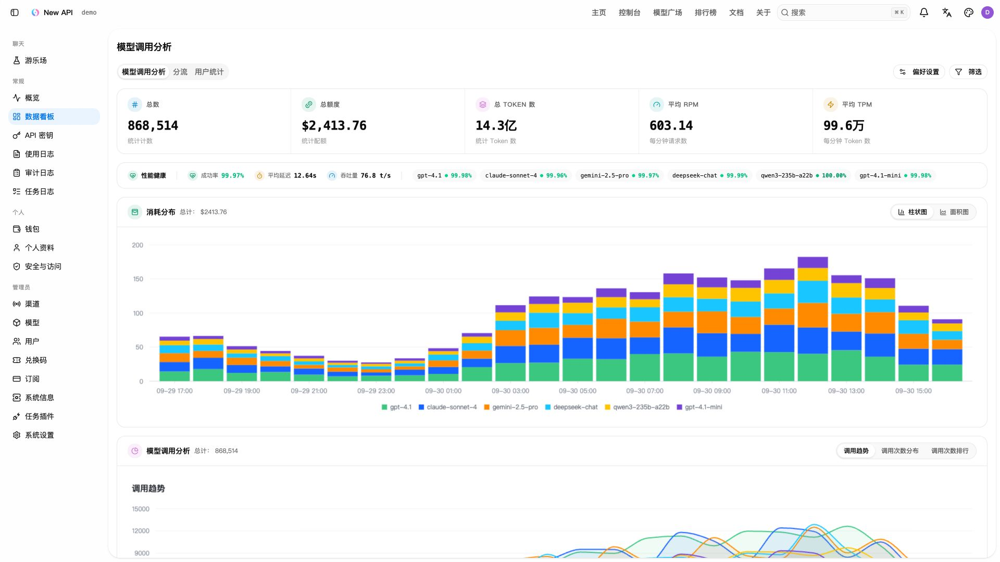

<div align="center">


# New API

**连接模型、应用与 Agent 的 AI 网关**

<p align="center">
  <strong>简体中文</strong> |
  <a href="./README.zh_TW.md">繁體中文</a> |
  <a href="./README.md">English</a> |
  <a href="./README.fr.md">Français</a> |
  <a href="./README.ja.md">日本語</a>
</p>

<p align="center">
  <a href="https://raw.githubusercontent.com/Calcium-Ion/new-api/main/LICENSE">
    
  </a><!--
  --><a href="https://github.com/Calcium-Ion/new-api/releases/latest">
    
  </a><!--
  --><a href="https://hub.docker.com/r/CalciumIon/new-api">
    
  </a>
  <a href="https://atomgit.com/QuantumNous/new-api" target="_blank">
    
  </a>
</p>

<p align="center">
  <a href="https://trendshift.io/repositories/20180" target="_blank">
    
  </a>
  <br>
  <a href="https://hellogithub.com/repository/QuantumNous/new-api" target="_blank">
    
  </a><!--
  -->
  <a href="https://atomgit.com/QuantumNous/new-api" target="_blank">
    
  </a>
</p>

<p align="center">
  <a href="#screenshots">项目截图</a> •
  <a href="#capabilities">核心能力</a> •
  <a href="#quick-start">快速开始</a> •
  <a href="#deployment">部署运维</a> •
  <a href="#development">开发扩展</a> •
  <a href="#documentation">文档社区</a>
</p>

</div>

---

## 📝 项目说明

New API 是面向应用、Agent 和团队的自托管 AI 网关。将不同厂商的模型服务接入统一入口，在同一套控制台中管理渠道、访问权限、用量与成本。

你可以用它为团队分配已授权的模型资源，在切换上游时减少客户端改动，或搭建自己的多模型服务。支持接入 OpenAI、Anthropic、Google Gemini、Azure OpenAI、AWS Bedrock、Vertex AI、DeepSeek、通义千问及其他兼容服务。

> [!IMPORTANT]
> - 本项目仅面向合法授权的 AI API 网关、组织内部鉴权、多模型管理、用量统计、成本核算和私有化部署场景。
> - 使用者必须合法取得上游 API Key、账号、模型服务或接口权限，并遵守上游服务条款及适用法律法规。
> - 使用者应确保其使用方式符合上游服务条款及适用法律法规。
> - 面向公众提供生成式人工智能服务时，使用者应遵守[《生成式人工智能服务管理暂行办法》](http://www.cac.gov.cn/2023-07/13/c_1690898327029107.htm)等监管要求，自行完成所在司法辖区要求的备案、许可、内容安全、实名、日志留存、税务和上游授权等合规义务。

<!-- -->

> [!WARNING]
> 将本项目作为面向公众的生成式 AI 服务或 API 转售服务运营时，使用者应先完成备案、内容安全、实名、日志留存、税务、支付和上游授权等合规义务。

---

<a id="screenshots"></a>

## 项目截图

以下账号、渠道、插件安装状态、用量、价格和费用均为模拟数据，插件市场展示官方目录。点击图片可查看原图。

| 数据看板 | 插件市场 |
| --- | --- |
| [](assets/screenshots/dashboard.zh-CN.jpg) | [](assets/screenshots/plugin-marketplace.zh-CN.jpg) |
| **模型广场** | **使用日志** |
| [](assets/screenshots/models.zh-CN.jpg) | [](assets/screenshots/usage-logs.zh-CN.jpg) |

---

## 🤝 我们信任的合作伙伴

<p align="center">
  <em>排名不分先后</em>
</p>

<p align="center">
  <a href="https://www.cherry-ai.com/" target="_blank">
    
  </a><!--
  --><a href="https://github.com/iOfficeAI/AionUi/" target="_blank">
    
  </a><!--
  --><a href="https://bda.pku.edu.cn/" target="_blank">
    
  </a><!--
  --><a href="https://www.aliyun.com/" target="_blank">
    
  </a><!--
  --><a href="https://io.net/" target="_blank">
    
  </a>
</p>

---

## 🙏 特别鸣谢

<p align="center">
  <a href="https://www.jetbrains.com/?from=new-api" target="_blank">
    
  </a>
</p>

<p align="center">
  <strong>感谢 <a href="https://www.jetbrains.com/?from=new-api">JetBrains</a> 为本项目提供免费的开源开发许可证</strong>
</p>

---

<a id="capabilities"></a>

## 核心能力

| 方向 | 可以做什么 |
| --- | --- |
| 模型接入 | 支持 OpenAI Chat Completions、Responses、Anthropic Messages 和 Gemini 协议，以及上游支持的流式输出、工具调用、推理与多模态输入 |
| 渠道调度 | 配置模型映射、渠道优先级与权重、失败重试、渠道亲和性和多密钥管理 |
| 用量与成本 | 管理额度、订阅套餐、用量日志、缓存计费，以及基于表达式的阶梯定价 |
| 访问控制 | 管理用户、分组、细粒度权限和 API Key 限制；支持 OAuth/OIDC、通行密钥、两步验证与登录会话管理 |
| 异步任务 | 通过 JavaScript 插件扩展图片、视频等任务 API，统一查询任务状态和获取产物 |
| Web 控制台 | 配置渠道与模型、查看用量和审计日志、在 Playground 中调试模型；支持简体中文、繁体中文、英语、法语、日语、俄语和越南语 |

### 协议与接口

| 接口类型 | 常用入口 |
| --- | --- |
| OpenAI Chat / Responses | `POST /v1/chat/completions`、`POST /v1/responses` |
| Anthropic Messages | `POST /v1/messages` |
| Gemini | `POST /v1beta/models/{model}:generateContent`、`POST /v1beta/models/{model}:streamGenerateContent` |
| Realtime / Responses WebSocket | `GET /v1/realtime`、`GET /v1/responses`（WebSocket 升级） |
| 图片 / 音频 | `/v1/images/generations`、`/v1/images/edits`、`/v1/audio/speech`、`/v1/audio/transcriptions`、`/v1/audio/translations` |
| 向量 / 重排 | `POST /v1/embeddings`、`POST /v1/rerank` |
| 任务插件 | `POST /v1/tasks/{pluginKey}`、`GET /v1/tasks/{taskId}`，以及各插件声明的协议路由 |

[RelayKit](./relaykit/README.md) 提供上述四种文本协议之间的请求、响应和流式转换。实际可用能力取决于渠道、上游模型和转换路径；协议特有的工具与字段可能无法完整映射。WebSocket 同样需要上游与渠道配置支持。

本 README 描述当前源码的能力，部署时请同时查看所选版本的发布说明。

### 分组倍率模式

管理员在 `/dynamic-ratio` 为每个分组选择固定、余额（现有规则）或并发模式；用户可在 `/rate-limit` 查看分组负载和倍率阶梯。三种模式互斥，切换不会删除另一套配置。尚未保存模式的分组沿用原动态倍率总开关；保存后的分组独立生效。

并发阶梯使用「处理中数量 ≥ 阈值」匹配，数量包含本次接纳的请求。基础分组倍率（包括用户专属分组倍率）乘以所选阶梯系数得到最终倍率。同组重试及结算沿用接纳时快照；切换分组时转移占位并在下一次上游请求前补足预留。返回之前使用过的分组时沿用该次调用已锁定的价格。

HTTP/SSE 计数至请求结束；Responses WebSocket 按每次生成计数，Realtime 按上游会话计数；任务插件的异步任务持续计数至终态，并从数据库恢复占位。多实例需要共同使用 Redis 和相同版本；无 Redis 时仅统计本实例。Redis 不可用时并发模式拒绝新请求，避免按虚构负载计费。异常进程的 HTTP 占位最多保留 120 秒，后台任务每 30 秒恢复一次。

旧版 Midjourney 的任务记录未保存计费分组，目前需使用固定或余额模式。倍率调节不会替代原有并发限流。页面每 5 秒更新，仅提供实时估计；消费记录保存本次实际模式、并发数和系数。

<a id="quick-start"></a>

## 快速开始

### 使用 Docker 本地体验

以下命令使用 SQLite 启动单实例，仅监听本机端口：

```bash
mkdir -p data
docker run --name new-api -d --restart unless-stopped \
  -p 127.0.0.1:3000:3000 \
  -e TZ=Asia/Shanghai \
  -v "$(pwd)/data:/data" \
  calciumion/new-api:latest
```

打开 [http://localhost:3000](http://localhost:3000)，按初始化向导创建管理员账号。SQLite 数据库存放在挂载的 `data` 目录中，更换容器后仍会保留。

### 发起第一次请求

1. 新建渠道，填写上游 API Key、可用模型和所属分组，执行渠道测试。
2. 配置模型价格，确保调用用户有可用额度或有效订阅。
3. 在控制台创建 API Key，确保它能访问对应分组和模型。
4. 对于 OpenAI 兼容客户端，将 Base URL 设为 `http://localhost:3000/v1`，密钥使用 **New API 签发的 Key**。

在终端中将 `NEW_API_KEY` 环境变量设为该密钥，查询它可以访问的模型：

```bash
curl --fail-with-body http://localhost:3000/v1/models \
  -H "Authorization: Bearer ${NEW_API_KEY}"
```

然后调用 Responses，将 `your-enabled-model` 替换为已启用且支持该接口的模型名称：

```bash
curl --fail-with-body http://localhost:3000/v1/responses \
  -H "Authorization: Bearer ${NEW_API_KEY}" \
  -H "Content-Type: application/json" \
  -d '{"model":"your-enabled-model","input":"Hello!"}'
```

<a id="deployment"></a>

## 部署与运维

### Docker Compose

仓库的 [Compose 配置](./docker-compose.yml) 默认启动 **New API + PostgreSQL + Redis**，并提供 MySQL 和独立 ClickHouse 日志库的配置示例。

```bash
git clone https://github.com/QuantumNous/new-api.git
cd new-api
```

启动前编辑 `docker-compose.yml`：同时替换数据库、Redis 服务及对应连接串中的示例密码，并设置固定的随机 `SESSION_SECRET`（可用 `openssl rand -hex 32` 生成）。通过 HTTPS 访问控制台时，设置 `SESSION_COOKIE_SECURE=true`，并在 `SESSION_COOKIE_TRUSTED_URL` 中填写控制台对外的精确 HTTPS Origin。

```bash
docker compose up -d
docker compose logs -f new-api
```

### 存储与配置

| 组件 | 可选方案 |
| --- | --- |
| 主数据库 | SQLite、MySQL ≥ 5.7.8、PostgreSQL ≥ 9.6 |
| 独立日志库 | 通过 `LOG_SQL_DSN` 配置，额外支持 ClickHouse |
| 缓存 | 可选 Redis 与内存缓存；多节点需要共享限流额度时使用共享 Redis |
| 容器平台 | Linux amd64 / arm64 |

| 环境变量 | 用途 |
| --- | --- |
| `SQL_DSN` | 主数据库连接串；未设置时使用 SQLite |
| `LOG_SQL_DSN` | 可选的独立日志数据库连接串 |
| `REDIS_CONN_STRING` | Redis 连接串 |
| `SESSION_SECRET` | 持久保存的鉴权密钥，所有节点必须一致 |
| `CRYPTO_SECRET` | 默认使用 `SESSION_SECRET`；共享 Redis 的节点必须使用相同的有效值 |
| `SESSION_COOKIE_SECURE` | HTTPS 控制台设为 `true`，启用 Secure 刷新 Cookie 和严格的刷新／退出来源校验 |
| `SESSION_COOKIE_TRUSTED_URL` | Secure 模式必填：以逗号分隔的精确 HTTPS Origin，不含路径或通配符；本地 HTTP 模式不设置 |
| `TRUSTED_PROXIES` | 可信反向代理 IP/CIDR，或 `none`；按实际网络显式配置 |

完整配置见[环境变量示例](./.env.example)、[环境变量文档](https://docs.newapi.ai/zh/docs/installation/config-maintenance/environment-variables)和[鉴权与登录会话说明](./docs/authentication.md)。容器变量应通过 Compose 的 `environment` 或 `env_file` 注入；只复制 `.env.example` 不会自动将变量传入容器。

正式部署时使用 HTTPS，并配置反向代理支持流式响应与 WebSocket 升级。持久化并备份数据库和挂载数据。多节点必须共用主数据库和鉴权密钥；独立 Redis 或内存限流器会按节点分别计数。不同拓扑下的会话传播行为见鉴权文档。

从[发布页](https://github.com/QuantumNous/new-api/releases)选择明确的镜像版本，阅读升级说明并先备份再升级。`latest` 会随发布构建变化；已有实例应按实际版本评估迁移与兼容性。

<a id="development"></a>

## 开发与扩展

后端使用 Go 和 Gin；控制台使用 React 19、TypeScript、Rsbuild、TanStack 与 Tailwind CSS 4。前端依赖和脚本使用 Bun；Go 语言基线见 [go.mod](./go.mod)，容器构建工具链见 [Dockerfile](./Dockerfile)。

<a id="local-docker-testing"></a>

### Docker Desktop 本地测试

当前 Windows 工作区后续的页面检查、前后端联调和本地验收，默认复用 [docker-compose.local.yml](./docker-compose.local.yml) 中的 `new-api-local` 项目。该环境包含从当前源码构建的完整前后端、SQLite 和 Redis。

| 项目 | 当前配置 |
| --- | --- |
| 访问地址 | [http://127.0.0.1:3001](http://127.0.0.1:3001)，仅本机访问 |
| 限流用量页面 | [常规 → 限流用量](http://127.0.0.1:3001/rate-limit) |
| 本地管理员 | `admin`，沿用已设置的本地密码 |
| 数据目录 | `D:\Docker\new-api-local\data`；数据库为其中的 `one-api.db`，应用日志位于 `logs/` |
| 运行密钥文件 | `D:\Docker\new-api-local\runtime.env`，已在本机配置，密钥值不提交到仓库 |
| Docker 镜像与构建缓存 | 实际位于 `D:\Docker\wsl`；当前 C: 下的 Docker `wsl` 路径为指向该目录的链接 |

先启动 Docker Desktop，再在仓库根目录执行以下 PowerShell 命令：

```powershell
# 启动已有镜像并等待服务就绪
docker compose -f docker-compose.local.yml up -d --wait

# 修改 Go 或前端代码后，重新构建并更新容器
docker compose -f docker-compose.local.yml up -d --build --wait

# 查看健康状态与最近日志
docker compose -f docker-compose.local.yml ps
docker compose -f docker-compose.local.yml logs --tail 100 new-api
Invoke-RestMethod http://127.0.0.1:3001/api/status

# 暂停或移除本项目容器；绑定在 D: 的应用数据仍保留
docker compose -f docker-compose.local.yml stop
docker compose -f docker-compose.local.yml down
```

镜像内嵌前端和 Go 可执行文件，单纯 `restart` 不会加载源码改动。更新后应确认两个服务均为 `healthy`、`/api/status` 返回 `success: true`，再检查本次改动涉及的页面与接口；涉及持久化时还应验证容器重启后数据仍可使用。该环境补充定向自动化测试，数据库相关改动仍须执行 SQLite、MySQL、PostgreSQL 验证矩阵，RelayKit 相关改动仍须独立构建。

需要前端热更新时，保留 Docker 后端，并在另一个 PowerShell 终端的 `web/` 目录执行：

```powershell
$env:VITE_REACT_APP_SERVER_URL = 'http://127.0.0.1:3001'
bun run dev -- --port 5173
```

此时访问 [http://localhost:5173](http://localhost:5173)。本机 3000 端口属于其他应用，前端代理应使用 3001。

日常测试直接复用 Docker 数据目录，不要用仓库根目录或 `tmp/rate-limit-preview/` 下的旧数据库覆盖它。Compose 支持通过 `NEW_API_LOCAL_HOME`、`NEW_API_LOCAL_PORT` 调整应用数据根目录和访问端口；数据根目录需要预先存在 `data/` 和 `runtime.env`。这些变量不会改变 Docker 引擎的镜像存储位置，重装或调整 Docker Desktop 后应再次确认镜像、缓存和数据仍落在非 C: 盘。清理镜像和构建缓存释放的是 Docker 内部空间，虚拟磁盘文件可能需要单独压缩才会向宿主机归还空间。

### 原生进程开发

后端会嵌入 `web/dist`，首次启动前先构建前端：

```bash
# 仓库根目录
cd web
bun install --frozen-lockfile
bun run build
cd ..
go run .
```

在另一个终端启动前端开发服务器：

```bash
cd web
bun run dev -- --port 5173
```

访问 [http://localhost:5173](http://localhost:5173)，开发服务器会将 API 请求代理到 3000 端口的后端。需要容器化开发后端时，参阅 [docker-compose.dev.yml](./docker-compose.dev.yml) 和 [makefile](./makefile) 中的 `make dev`。

| 目录 | 职责 |
| --- | --- |
| `router/`、`middleware/`、`controller/` | HTTP 路由、访问校验与 API 处理 |
| `relay/` | 上游适配与请求调度 |
| `service/`、`model/` | 业务逻辑与持久化 |
| [relaykit/](./relaykit/README.md) | 可独立构建的协议 DTO 与转换 Go 模块 |
| [plugins/tasks/](./plugins/tasks/) | JavaScript 任务插件；编写方式与宿主边界见 [Task Plugin API v1](./docs/plugin-api/v1.md) |
| `web/` | Web 控制台，参阅[前端开发约定](./web/AGENTS.md) |
| [electron/](./electron/README.md) | 桌面封装与打包 |

贡献前请阅读 [AGENTS.md](./AGENTS.md)。按改动范围执行检查：Go 模块使用 `make test`；前端在 `web/` 下运行 `bun run typecheck`、`bun run lint`、`bun run test` 和 `bun run build`。修改 RelayKit 后还必须在 `relaykit/` 下执行 `GOWORK=off go build ./...`。

<a id="documentation"></a>

## 文档与社区

| 资源 | 入口 |
| --- | --- |
| 官方文档 | [使用指南](https://docs.newapi.ai/zh/docs) · [安装部署](https://docs.newapi.ai/zh/docs/installation) · [API 参考](https://docs.newapi.ai/zh/docs/api) |
| 项目导读 | [DeepWiki](https://deepwiki.com/QuantumNous/new-api) |
| 使用问题与交流 | [常见问题](https://docs.newapi.ai/zh/docs/support/faq) · [社区渠道](https://docs.newapi.ai/zh/docs/support/community-interaction) |
| 缺陷与功能建议 | [GitHub Issues](https://github.com/QuantumNous/new-api/issues) |
| 安全漏洞 | 按[安全政策](./.github/SECURITY.md)进行私下报告 |

反馈问题时请附上版本、部署方式、复现步骤及脱敏日志。欢迎贡献文档、翻译、渠道适配和有针对性的回归测试。

---

## 🔗 相关项目

### 上游项目

| 项目 | 说明 |
|------|------|
| [One API](https://github.com/songquanpeng/one-api) | 原版项目基础 |
| [Midjourney-Proxy](https://github.com/novicezk/midjourney-proxy) | Midjourney 接口支持 |

### 配套工具

| 项目 | 说明 |
|------|------|
| [new-api-key-tool](https://github.com/Calcium-Ion/new-api-key-tool) | Key 额度查询工具 |
| [new-api-horizon](https://github.com/Calcium-Ion/new-api-horizon) | New API 高性能优化版 |

---

## 📜 许可证

本项目采用 [GNU Affero 通用公共许可证 v3.0 (AGPLv3)](./LICENSE) 授权。

根据 AGPLv3 第 7 条，本项目还适用[附加条款](./NOTICE)。修改版本必须在适当法律声明及界面中显著的关于、法律、页脚或署名位置保留作者署名 `Frontend design and development by New API contributors.`，并保留指向原项目 <https://github.com/QuantumNous/new-api> 的可见链接。

本项目为开源项目，在 [One API](https://github.com/songquanpeng/one-api)（MIT 许可证）的基础上进行二次开发。

如果您所在的组织政策不允许使用 AGPLv3 许可的软件，或您希望规避 AGPLv3 的开源义务，请发送邮件至：[support@quantumnous.com](mailto:support@quantumnous.com)

署名及依赖声明见 [NOTICE](./NOTICE) 和[第三方许可证](./THIRD-PARTY-LICENSES.md)。

---

## 🌟 Star History

<div align="center">

[](https://star-history.com/#Calcium-Ion/new-api&Date)

</div>

---

<div align="center">

### 💖 感谢使用 New API

如果这个项目对你有帮助，欢迎给我们一个 ⭐️ Star！

**[官方文档](https://docs.newapi.ai/zh/docs)** • **[问题反馈](https://github.com/Calcium-Ion/new-api/issues)** • **[最新发布](https://github.com/Calcium-Ion/new-api/releases)**

<sub>Built with ❤️ by QuantumNous</sub>

</div>
